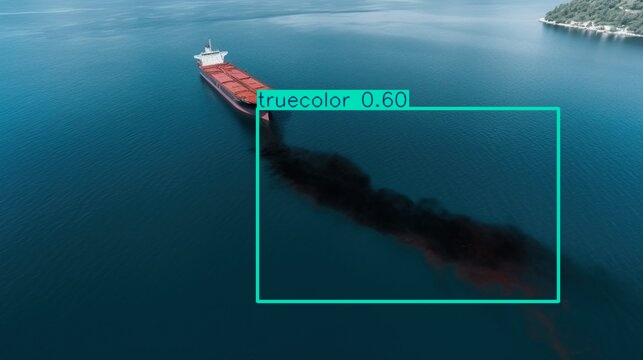
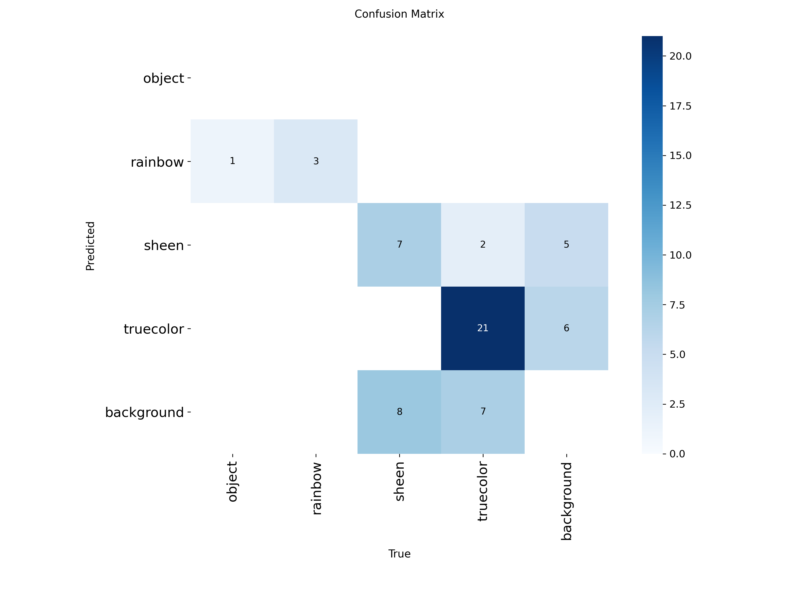

# Oil Spill Detection App

[](https://www.python.org/)
[](https://github.com/ultralytics/ultralytics)
[](LICENSE)

A YOLO-based deep learning application for detecting oil spills in images. This repository provides scripts for image inference, annotated result saving, and detection visualization.

---

## Table of Contents

- [Features](#features)
- [Requirements](#requirements)
- [Installation](#installation)
- [Usage](#usage)
- [Example Results](#example-results)
- [Confusion Matrix](#confusion-matrix)
- [Model](#model)
- [Contributing](#contributing)
- [License](#license)

---

## Features

- 🚩 Detect oil spills in images
- 🖼️ Annotated output with bounding boxes
- 🐍 Easy-to-use Python scripts
- 💾 Results saved for further analysis

---

## Requirements

- Python 3.8+
- [Ultralytics YOLO](https://github.com/ultralytics/ultralytics)
- OpenCV
- Matplotlib

---

## Installation

Clone the repository and install dependencies:

```sh
git clone https://github.com/yourusername/oil-spill-detection-app.git
cd oil-spill-detection-app
pip install ultralytics opencv-python matplotlib
```

---

## Usage

### Image Detection

Run the following command to detect oil spills in an image:

```sh
python test.py
```

- **Input image:** `img.jpg`
- **Output:** Annotated image saved in `runs/detect/predict/`

---

## Example Results

### Input Image


### Predicted Output



---

## Confusion Matrix

The confusion matrix below shows the performance of the model on the test set.



---

## Model

The trained YOLO model is included as `best.pt`.

---

## Contributing

Contributions are welcome! Please open issues or submit pull requests for improvements or bug fixes.

---

## License

This project is licensed under the MIT License. See [LICENSE](LICENSE) for details.

---

> **Note:** Update image paths and model file names as needed for your repository
