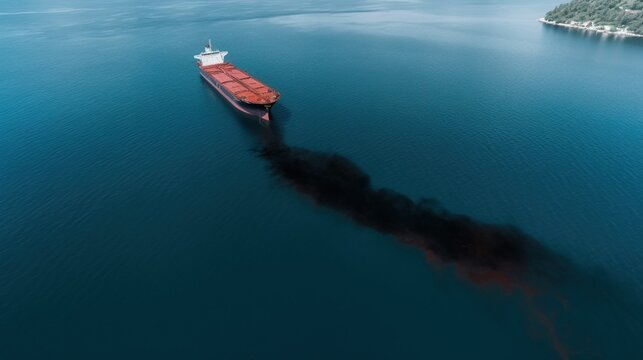

# Oil Spill Detection App

This project uses a YOLO-based deep learning model to detect oil spills in images. The app provides scripts for image inference, saving annotated results, and visualizing detections.

## Features

- Detect oil spills in images
- Annotated output with bounding boxes
- Easy-to-use Python scripts
- Results saved for further analysis

## Requirements

- Python 3.8+
- [Ultralytics YOLO](https://github.com/ultralytics/ultralytics)
- OpenCV
- Matplotlib

Install dependencies:
```sh
pip install ultralytics opencv-python matplotlib
```

## Usage

### Image Detection

Run the following command to detect oil spills in an image:

```sh
python test.py
```

- Input image: `img.jpg`
- Output: Annotated image saved in `runs/detect/predict/`

## Example Results

### Input Image



### Predicted Output (Image)


## Confusion Matrix

The confusion matrix below shows the performance of the model on the test set.


## Model

The trained YOLO model is included as `best.pt`.

## License

See [LICENSE](LICENSE) for details.
